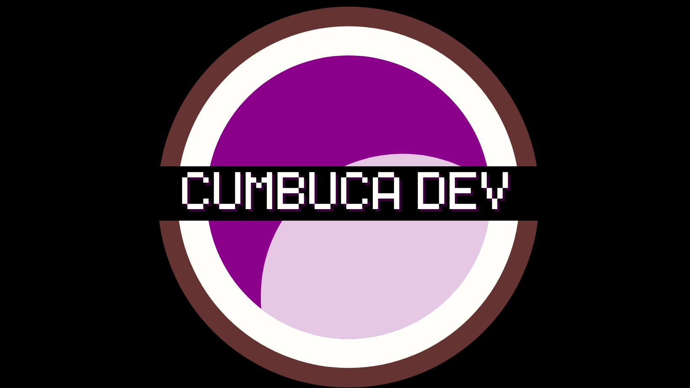
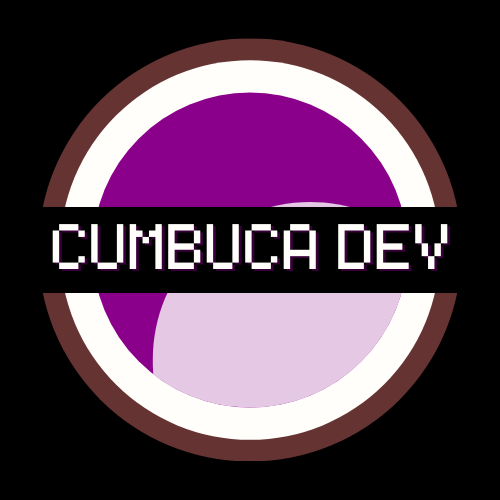
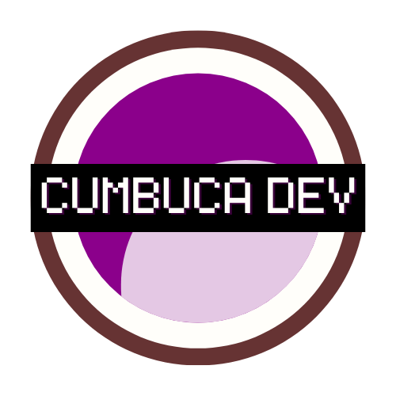
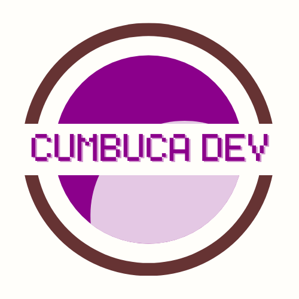
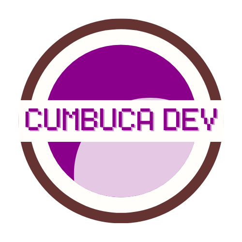
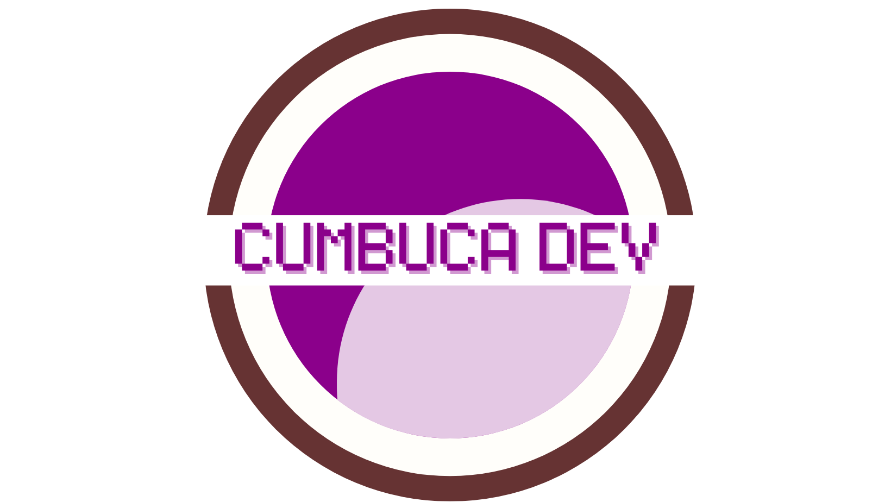

# Design

Organização Cumbuca Dev - logos, ícones e paleta de cores

## Logo

### Escuro 

### Escuro e transparente

### Claro

### Claro e  transparente

## Hero

### Escuro

### Claro

## Cores da Logo

- `#663333`
- `#FFFEFA`
- `#8B008B`
- `#E4C8E4`

## Cores da Organização

- Cor Principal: `#8B008B`
- Cor Secundária:  `#E4C8E4`
- Cor Destaques:  `#FFF2FF`
- Cor Destaques 2: `#380038`

